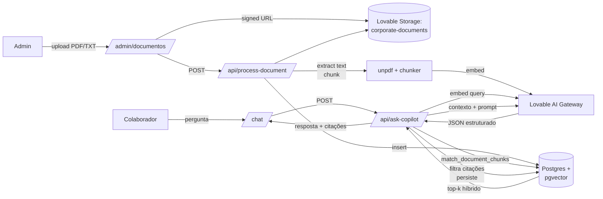

# Arquitetura

## Diagrama

## Camadas

### Frontend (TanStack Start / React 19)
- `src/routes/index.tsx` — landing pública.
- `src/routes/auth.tsx` — apenas login email/senha (sem signup público, sem reset self-service).
- `src/routes/_authenticated/` — subtree protegido (`ssr: false`, gate de sessão).
  - `chat.tsx` — copiloto com histórico, citações e feedback.
  - `admin.documentos.tsx` — CRUD de documentos (só admin).
  - `admin.qualidade.tsx` — painel de métricas (só admin).
  - `conhecimento.tsx` — catálogo somente-leitura dos publicados.
- `src/routes/{sobre,governanca}.tsx` — páginas institucionais.

### Camada de servidor (TanStack server functions e routes)
- `src/lib/documents.functions.ts` — criação, publicação, arquivamento, signed URL.
- `src/lib/conversations.functions.ts` — conversas, mensagens, feedback.
- `src/lib/quality.functions.ts` — métricas do painel de qualidade.
- `src/routes/api/process-document.ts` — pipeline de ingestão (Bearer + admin).
- `src/routes/api/ask-copilot.ts` — pipeline RAG (Bearer + auth).

### RPCs de segurança (Postgres, `SECURITY DEFINER`)
- `has_role(uid, role)` — checagem de papel sem recursão em policies.
- `match_document_chunks(query_embedding, query_text, k)` — busca
  híbrida filtrando `published + ready + vigente + classification='demo'`
  para não-admins.
- `record_audit(action, resource_type, resource_id, metadata)` —
  única via que `authenticated` pode gravar em `audit_events`.
- `record_and_check_ask_limit(per_hour, per_day)` — insere em
  `usage_events` e decide o rate limit na mesma transação (evita corrida).

### Dados (Lovable Cloud / Postgres)
- `profiles`, `user_roles` (+enum `app_role`), `has_role()`.
- `documents` (metadados, status, versão, checksum) e `document_chunks` (`halfvec(3072)` + `tsvector`, índice HNSW cosseno).
- `conversations`, `messages`, `feedback`.
- `evaluation_cases`, `audit_events`, `usage_events`.
- Storage privado `corporate-documents` (policies admin-only).

### IA (Lovable AI Gateway)
- `google/gemini-embedding-2` — 3072d.
- `openai/gpt-5.5` — chat, `response_format: json_object`.

## Fluxo de segurança
- RLS habilitado em todas as tabelas de dados; policies escopadas por `auth.uid()` e por `has_role`.
- Documentos e chunks com `classification` diferente de `demo` só são visíveis a admins (policies + RPC).
- `LOVABLE_API_KEY` e `SUPABASE_SERVICE_ROLE_KEY` **somente** em código server-side.
- Endpoints POST verificam token JWT, claims e papel antes de qualquer efeito.
- Auditoria em `audit_events` via RPC `record_audit` (publicação e arquivamento pela server fn; processamento pelo service-role no endpoint de ingestão).
- Cloud Auth: signup desabilitado, anônimo desabilitado, HIBP habilitado.